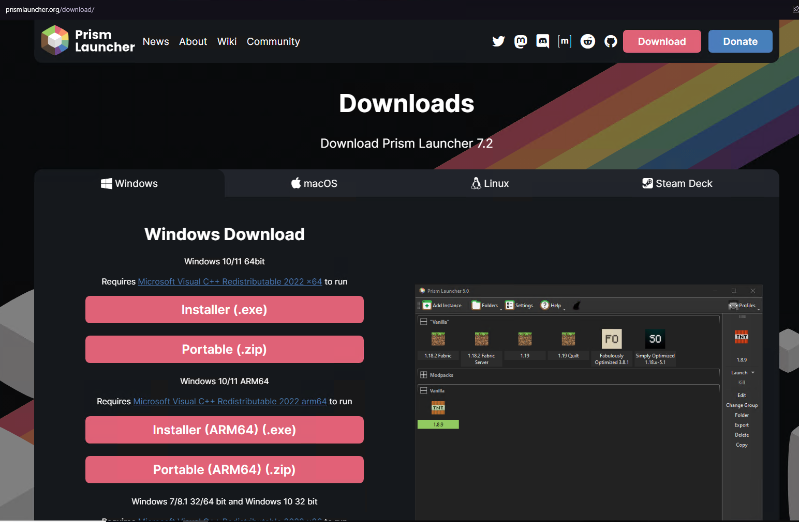
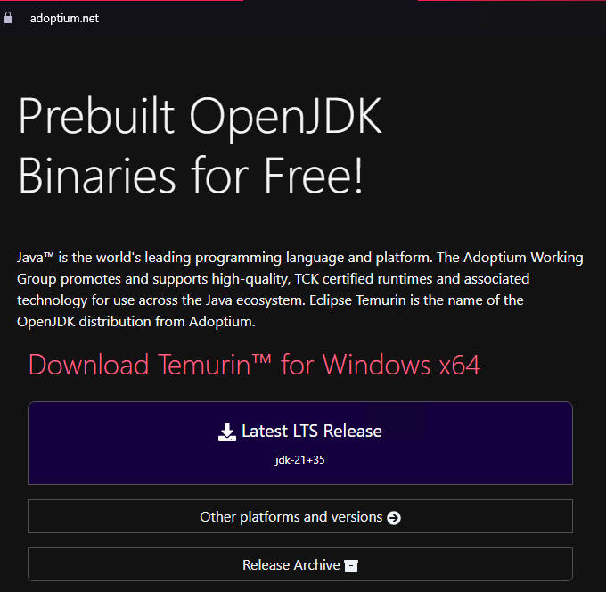
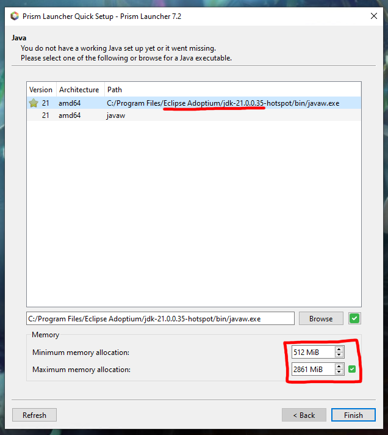
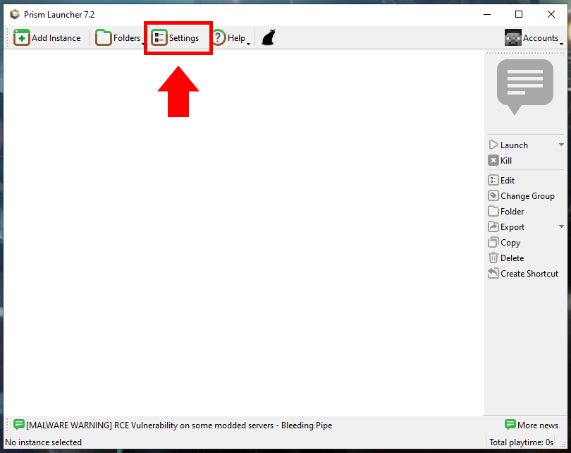
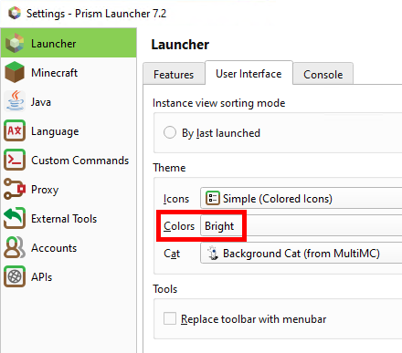
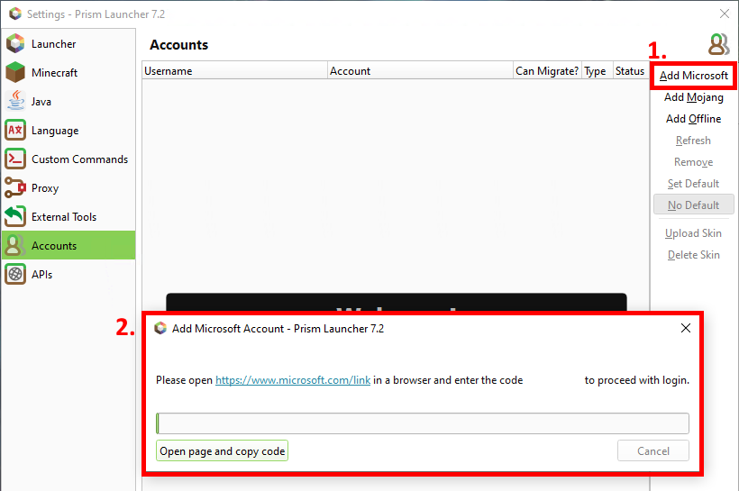
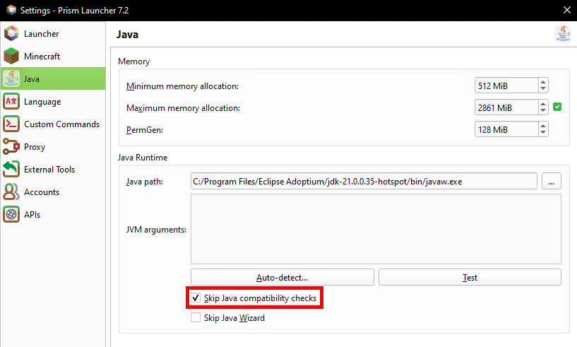
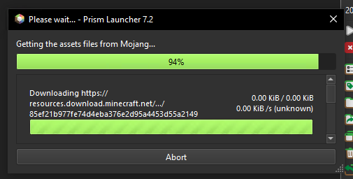

# Kraken Gang Modpack install guide

I'm going to show how to install [Prism Launcher](https://prismlauncher.org) as well as how to configure a profile for a [Fabric](https://fabricmc.net) installation.  

## Guide
1. You want to go to https://prismlauncher.org and download the installer.  
Choose whichever edition works for your system.  
Go through the installation process as you would with any other app.  
*(If you get an error something like "MSVCP140.dll was not found", you have to install the Microsoft Visual C++ Redistributable 2022 x64 which can also be found on the Prism Launcher download page)*

2. Before starting Prism Launcher, you may want to go to https://adoptium.net/ to download a java JDK.  
You can then click on "Latest LTS Release" and it'll take you to a download page.  
Install this as normal.  
*(This JDK is typically better optimised than the default ones you may have installed with minecraft.)*

3. Start Prism Launcher, and in the Quick Setup, select the Eclipse Adoptium JDK you installed.  
*Note: If this menu doesn't show up, scroll down to see how to do this in the settings page.*  
Here you can also setup your min/max memory allocations but we can set those up for our specific minecraft instance later.  

4. We will now setup the settings in Prism.  

- You can change to dark mode under User Interface in the Launcher settings
 

- **NB!** You can add a Microsoft account in the accounts page if you have a legit copy of Minecraft.  
Simply click on the "Add Microsoft"/"Add Mojang" buttons and follow the instructions in the popup box.  

 - (Prism launcher just needs your Microsoft account to confirm you actually own Minecraft)
 

- Here you can also setup your Java path and min/max memory.  
**NB: Since we're running a new Java version, please remember to check "Skip Java compatability checks"**  

Note: If you get stuck in the "Getting the assets files from Mojang" part, just press "abort" and restart.   
