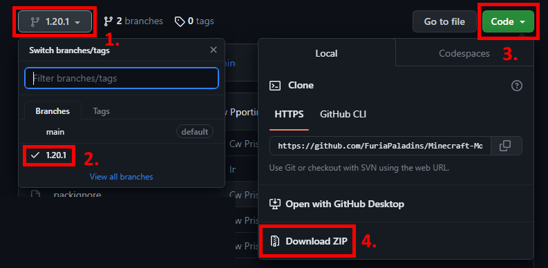
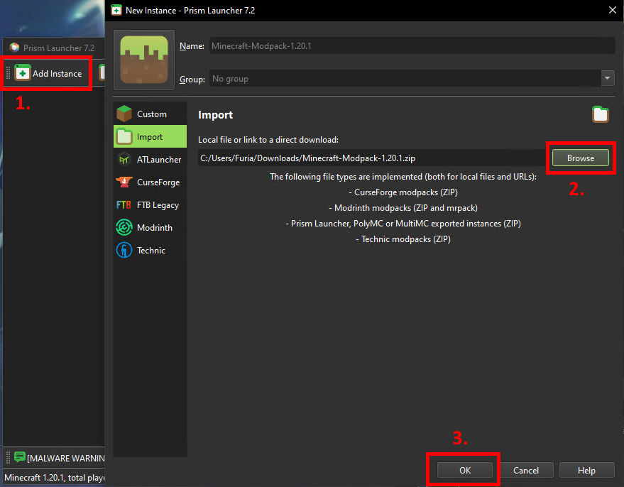
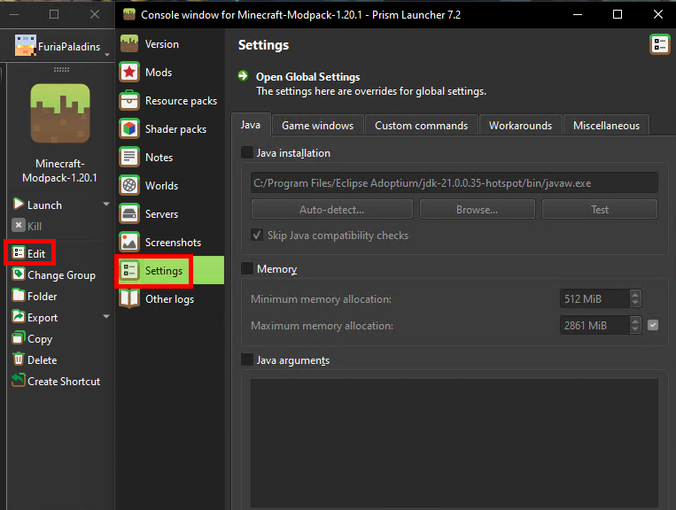
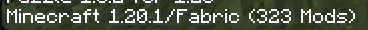

# Kraken Gang Modpack install guide

I'm going to show how to install [Prism Launcher](https://prismlauncher.org) as well as how to configure a profile for a [Fabric](https://fabricmc.net) installation.  

### Note: Prism will not work if you do not have a legit copy of Minecraft, you will just have to install the modpack manually. 
 - You can view step 5 in this guide on where and how to install the modpack from github. You just have to put the options.txt, mods and config folders from the .minecraft folder in the zip into your own .minecraft folder.
 - You also have to manually install [fabric from here](https://fabricmc.net) and be sure to select 1.20.1 for the current modpack

# Guide
## 1. You want to go to https://prismlauncher.org and download the installer.  
Choose whichever edition works for your system.  
Go through the installation process as you would with any other app.  
*(If you get an error something like "MSVCP140.dll was not found", you have to install the Microsoft Visual C++ Redistributable 2022 x64 which can also be found on the Prism Launcher download page)*

## 2. Before starting Prism Launcher, you may want to go to download GraalVM.
If you wish to install GraalVM manually [you can follow the steps here](https://www.graalvm.org/latest/getting-started/windows/)  
*(This JDK is typically better optimised than the default ones you may have installed with minecraft.)*

Otherwise, you can easily install GraalVM through [Chocolatey](https://chocolatey.org/install), which is a package manager.  
After installing Chocolatey through the link above, you can get GraalVM through [this chocolatey link](https://community.chocolatey.org/packages/graalvm) 

## 3. We will now setup the settings in Prism.  

### - You can change to dark mode under User Interface in the Launcher settings
 

### - **NB!** You can add a Microsoft account in the accounts page if you have a legit copy of Minecraft.  
Simply click on the "Add Microsoft"/"Add Mojang" buttons and follow the instructions in the popup box.  

### - Here you can also setup your Java path and min/max memory.  
(I recommend setting up RAM per-instance rather than globally, but it does not really matter. Around 8GB (8192 MB) is recommended for most modpacks, although try not to alocate over around 60% of your total RAM.)  
**NB: Since we're running a new Java version, please remember to check "Skip Java compatability checks"**   
***This is where you set GraalVM if you've followed the installation***

# 5. To setup our instance, first we need to download the modpack off github.
- Click on the branches button
- Select the modpack version we are currently playing on (1.20.1 as of writing this)
- Click on the "Code" button
- Select "Download ZIP"  

# 6. Now you can add the modpack as a new instance in Prism
- Click on "Add instance"
- Go to "Import" and find the ZIP file you downloaded from the step above  
- *You can now setup a custom name, group and icon. If you'd like the custom Kraken Gang icon that I've made, you can [download it from here](https://github.com/FuriaPaladins/Minecraft-Modpack/tree/main/src/kraken_icon.png)*  
  

# 7. (Optional)
## You can configure the modpack options before starting it.
- You can disable mods in the Mods section. Note: Please only remove client side mods - you will not be able to play properly if you disable any mods required on both client and server. (You can view list of client side mods on discord)
- You can add in resource and shader packs in their respective tabs
- You can add any notes you want here too, but it is not very important
- Server IP will be given on discord
- In settings you can override your global memory settings (Again, I recommend around 8GB (8192 MB) RAM, but try not to go over 60% of your total available RAM unless you know what you're doing.)  

# 8. You can now launch!
-  (First launch will typically take a while, this is completely normal)

- Note: If you get stuck in the "Getting the assets files from Mojang" part, just press "abort" and restart.   

# Other Notes:
- Do not worry if a very large amount of mods show up in the title menu. Most mods just have in-built dependencies that fabric counts separately.  

- Most optifine features like what [Fresh Animations](https://modrinth.com/resourcepack/fresh-animations) need are added in by other mods, no optifine required.
- On that note, PLEASE DO NOT INSTALL OPTIFINE INTO THIS MODPACK. The modpack is running on [Sodium and it's suite of mods](https://modrinth.com/mod/sodium) that are typically better for performance, and Optifine is much more prone to breaking.  
(Things like your optifine cape, zoom, etc, are also added in by other mods)
- There may be visual glitches with some Create machines but these are 100% visual, and do not cause any of your Create machines to break in any way. (Create is quite incompatible with performance mods such as Sodium and Optifine)
- If you would like to add any client-side mods, I recommend [browsing here on modrinth](https://modrinth.com/mods?g=categories:%27fabric%27&v=1.20.1&e=client) rather than curseforge if you can, as curseforge has had a few attacks that injected malware into quite a few mods on the page. 
- The hyperlinked page in the point above is also set to display fabric client side mods for 1.20.1. You can also browse resource packs/shaders on modrinth if needed.
